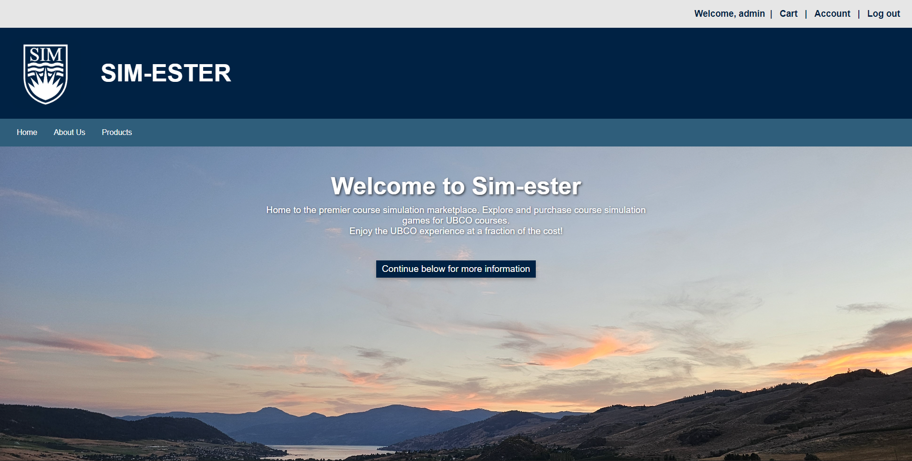

## Description
Sim-ester is a website that was developed for the COSC304 project. It is an online store that sells products depicting simulation-style games based on courses at UBC Okanagan.

Documentation can be found [here](https://rheiley.github.io/simester-documentation/documentation.pdf).

Sim-ester is hosted on https://sim-ester.onrender.com/ but can be accessed locally with Docker.

## Technologies & Tools
- [Node.js](https://nodejs.org/en)
- [Express.js](https://expressjs.com/)
- [Microsoft Azure](https://azure.microsoft.com/en-ca)
- [Render](https://render.com/)
- [Docker](https://www.docker.com/)

## Installation
Install the required dependencies (ensure Node.js is installed)
```bash
npm install
```

Create a file named .env in the root directory containing the following:
```bash
DB_SERVER: cosc304_sqlserver
DB_NAME: orders
DB_USER: user
DB_PASSWORD: COSC304rootpw
```

Run the following command:
```bash
docker-compose up -d
```

Now the website should be hosted on http://127.0.0.1. To load the data, navigate to http://127.0.0.1/loaddata. Then, the website should run while accessing the data.


## Screenshots



