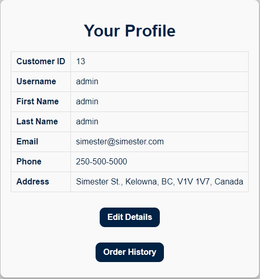

  

<h3 align="center">Sim-ester</h3>

  Hosted on <a>https://sim-ester.onrender.com</a>.
   

## Table of Contents
- [Description](#description)
- [Technologies and Tools](#technologies-and-tools)
- [Features](#features)
- [Screenshots](#screenshots)

## Description
Sim-ester is a website that was developed for the COSC304 project. It is an online store that sells products depicting simulation-style games based on courses at UBC Okanagan.

Documentation can be found [here](https://cmps-people.ok.ubc.ca/rlawrenc/teaching/304/Project/Samples/2024/2024_develop_1.pdf) (Please note that the documentation only contains features that were present during submission. This project has continued development after COSC304 and may include features that are not listed).

## Technologies and tools
- [Node.js](https://nodejs.org/en)
- [Express.js](https://expressjs.com/)
- [Neon](https://console.neon.tech/)
- [Render](https://render.com/)
- [Docker](https://www.docker.com/)
- [PostgreSQL](https://www.postgresql.org/)
- [SendGrid](https://sendgrid.com/en-us)

## Features
- **Product listings:** Display products with images, descriptions, and pricing.
- **Shopping cart:** Add, update, or remove items in real-time with visual updates.
- **Ratings and reviews:** Allow customers to rate and review purchased products.
- **Search and filter:** Find products by name and filter results by category.
- **Order history:** View past orders with details such as products, purchase date, and order total.

## Screenshots

